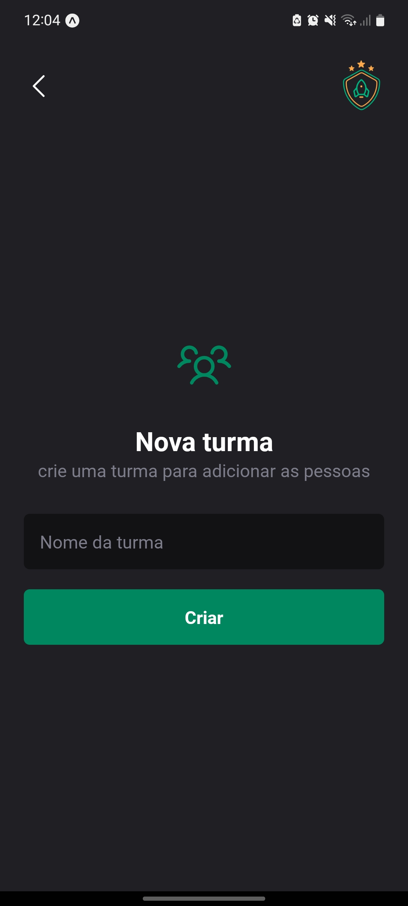
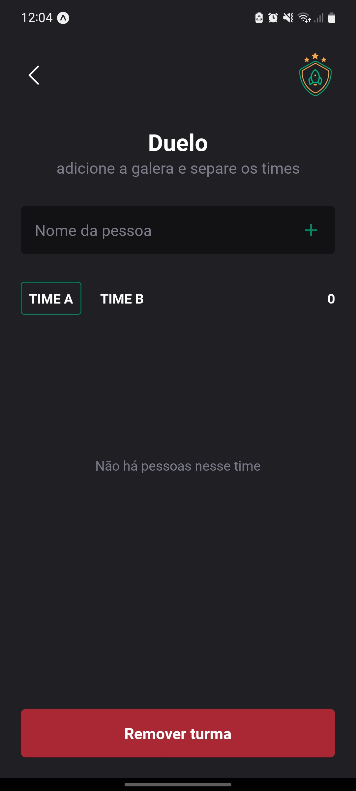
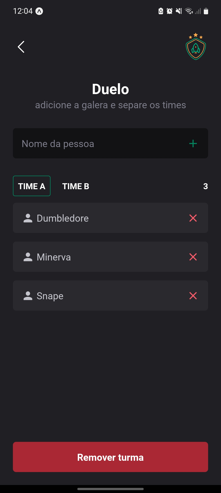
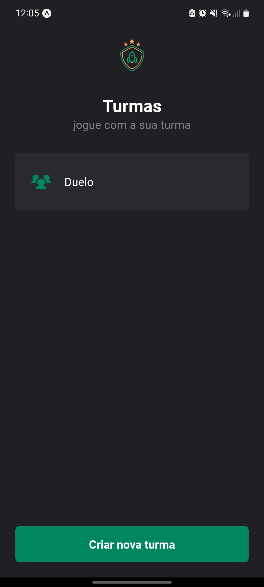

# Ignite Teams - Ignite | Rocketseat

## Português

#### Aplicativo de organização de times

A aplicação foi desenvolvida em React Native com Expo e Styled-components utilizando o design disponibilizado através do Figma. Nela o usuário pode cadastrar turmas e dentro das turmas adicionar pessoas em dois times, bem como removê-las e excluir a turma. Os dados persistem na memória do dispositivo.

## English

#### Team organization application

The application was developed in React Native with Expo and Styled-components using the design made available through Figma. In it the user can register classes and within the classes add people in two teams, as well as remove them and delete the class. The data persists in the device's memory.

## Screenshots

    

        
        
        
        
        
        
    

## Video

https://user-images.githubusercontent.com/86618257/199761580-a3f7b7fc-3503-425b-a13c-dbd88faba02b.mp4

## Stack

 
